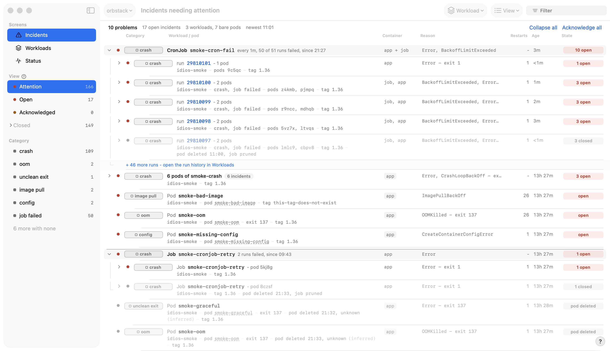
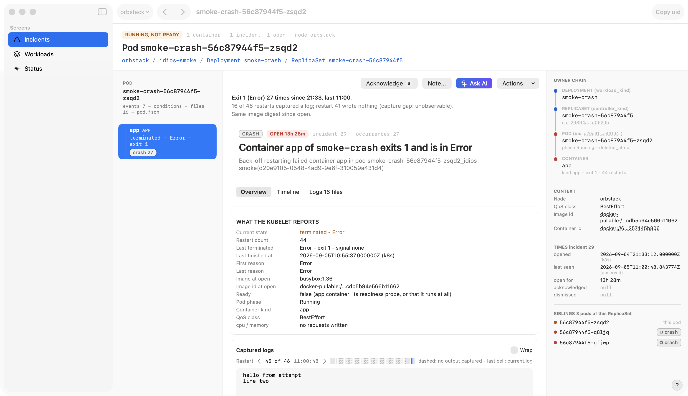
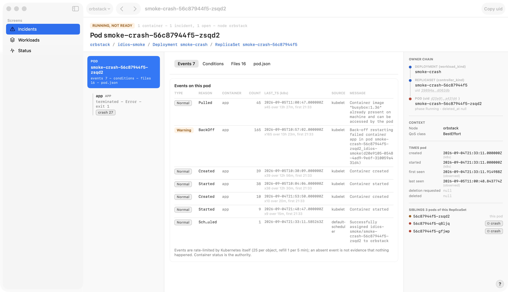
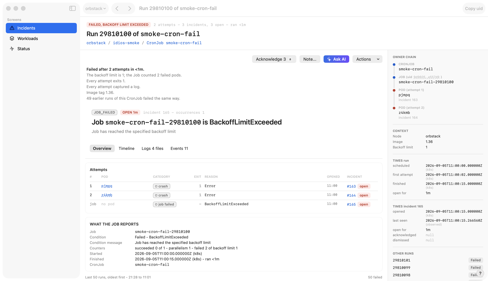
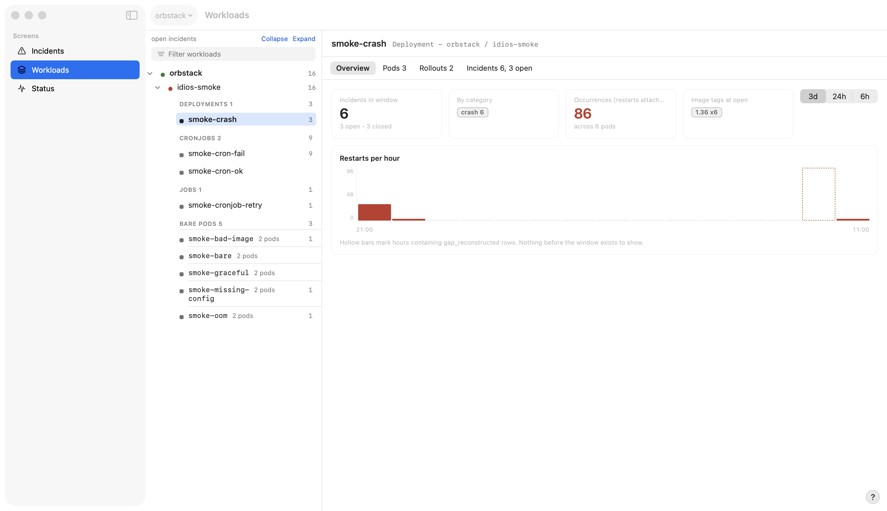

# idios

A local incident recorder for Kubernetes, with a macOS app. idios watches
your clusters, and the moment a pod or job fails it records what the
kubelet said, the events around it, and the last lines of the container's
logs -- so when you look, the evidence is already there, even if the pod
is long gone. And because the evidence is already there, one click hands
an incident to an AI agent, evidence and all: see [Ask AI](#ask-ai).



## Why

By the time you run `kubectl logs`, the interesting container has usually
restarted and the previous logs have rotated away; by the time you ask
"why did last night's job fail", the pod has been deleted and there is
nothing left to ask. idios is a flight recorder: it runs on your machine,
watches the namespaces you tell it to, and captures the evidence at the
moment of the failure. Everything lives in a local SQLite database and a
directory of captured files. Nothing leaves your Mac.

Failures are grouped into incidents by what the kubelet reported: crash,
oom, unclean exit (a container that dies badly while its pod is being
terminated), image pull, config, probe, scheduling, stuck, node pressure,
rescheduled, job failed. An incident stays open while the problem
persists, closes as recovered when the container stabilizes, and keeps
its captured logs either way.

## What an incident looks like

The list shows problems, not rows. Incidents are grouped by workload,
and inside a CronJob's group each run is one line that folds the Job's
own failure and its pods together; a group header carries the workload,
a plain sentence ("every 1m, 50 of 51 runs failed, since 21:27"), the
worst open category and how many are open. Colour means one thing: red
is open, amber acknowledged, grey closed, green healthy. A "?" beside
the sidebar's View heading opens a legend for every state, category and
kind, and Cmd-K opens a palette that jumps to any pod, run, workload or
incident by name.

Every incident lives on its pod's page. The pod and its containers are
the column on the left, each container wearing a badge per incident on
it; selecting a container leads with a verdict in sentences built from
what was recorded (what happened, how often since when, the memory
limit for an OOM, what was and was not captured, whether the image
changed), then the incident, then the kubelet's view of the container,
a scrubber over the log captured at each restart, the container's
events, and the incident's timeline with repeating cycles folded. The
rail carries the owner chain up to the Deployment or CronJob, the times,
and the pod's siblings; the identity line is a breadcrumb into
Workloads.



Selecting the Pod card shows the whole pod the way idios saw it last:
every container's events, the conditions, the captured files, and the
raw pod.json.



A Job a CronJob created is a run, and a run is a page of its own: how it
ended, one line per attempt with the pod, the exit code, the reason and
the incident it opened (an attempt that succeeded is a line too), what
the Job itself reports, and the strip of the schedule's other runs with
this one marked.



The workloads screen is a tree by cluster and namespace, Deployments,
CronJobs, Jobs and bare pods under plural captions, each with its open
count; a CronJob opens on its runs, a strip of one cell per run coloured
by outcome above the table. A menu bar item keeps the open count and the
problems behind it one click away, and every screen has a round [?] at
its bottom right that marks the parts worth knowing about and says, per
part, what it draws and why to look there.



## Ask AI

The recorder's other half. A recorded incident is exactly what an AI
agent needs to diagnose a failure -- the evidence is complete, local and
already assembled -- so every incident has an [Ask AI] button (top right
of the pod page above) with two outputs:

- **Prompt for a local agent (MCP)** -- a short prompt for an agent on
  your machine. The agent pulls the evidence itself over `idios mcp`, a
  read-only MCP server whose tools mirror how an investigation runs:
  list incidents, open one with its timeline, walk the pod's event
  stream, read a captured log a piece at a time (tail, byte range or
  grep -- never the whole file unless asked), and read the captured pod
  object.
- **Full snapshot** -- one self-contained prompt carrying the whole
  recorded evidence: detail, timeline, containers, events, every
  captured log, the pod object, the related incidents. For an agent or
  a chat window with no access to your machine.

Both prompts are generated by the daemon, so the prompt text and the MCP
tool vocabulary can never skew across versions, and both tell you their
size before you copy or save. The captured pod object leaves the machine
only sanitized: every environment value and the last-applied
annotation are redacted. The MCP server never opens the database -- it
is a loopback client of the daemon's API, so it needs the daemon
running: keep the app open, or start `idios run` yourself.

To give an agent standing access, register the MCP server. The installed
binary lives inside the app bundle and is not on PATH, so registrations
name it by its full path (the Ask AI sheet shows the exact entry for
your machine, with a Copy button):

Claude Code:

```sh
claude mcp add idios -- /Applications/idios.app/Contents/Resources/idios mcp
```

Claude Desktop (`~/Library/Application Support/Claude/claude_desktop_config.json`):

```json
{
  "mcpServers": {
    "idios": {
      "command": "/Applications/idios.app/Contents/Resources/idios",
      "args": ["mcp"]
    }
  }
}
```

Codex CLI (`~/.codex/config.toml`):

```toml
[mcp_servers.idios]
command = "/Applications/idios.app/Contents/Resources/idios"
args = ["mcp"]
```

Any other MCP client works the same way: the command is the binary, the
one argument is `mcp`. If you prefer `idios` on PATH:

```sh
sudo ln -sf /Applications/idios.app/Contents/Resources/idios /usr/local/bin/idios
```

## Install

idios is unsigned (no Apple developer account), so it is built on your
machine; nothing you run was downloaded as a binary. You need:

- macOS 15 or later
- Xcode (for the app)
- Go 1.21 or later (the build pulls the pinned toolchain itself)

```sh
git clone https://github.com/hasanMshawrab/idios.git
cd idios
./install.sh
```

The script builds the daemon and the app, bundles the daemon inside
`idios.app`, and installs it to `/Applications`. On first launch the app
asks for your kubeconfig (suggesting `~/.kube/config`), starts its
daemon, and walks you through adding the first cluster and the
namespaces to watch. The kubeconfig can be changed later in Settings;
credentials are never copied or stored -- idios keeps only the path and
the context name.

Data lives in `~/Library/Application Support/idios`. To uninstall:

```sh
rm -rf /Applications/idios.app ~/Library/Application\ Support/idios
```

## How it works

One Go daemon: client-go informers feed a single-writer SQLite database;
a capture pool tails logs the moment a container dies; retention sweeps
everything older than a few days. The macOS app is a SwiftUI client of
the daemon's local HTTP API. The design docs in `docs/design/` describe
the whole system: what is stored, how it is filled, how the process
runs, and how it is shown.

### Under the hood

- **Backend** -- a single Go process. It watches clusters through
  [kubernetes/client-go](https://github.com/kubernetes/client-go)
  informers (no polling, no kubectl), diffs each object against the
  stored snapshot, and writes history, incidents and captured files
  through one writer into [modernc.org/sqlite](https://gitlab.com/cznic/sqlite)
  (pure Go, no cgo). The API listens on loopback only.
- **Contract** -- the API is written once, as protobuf under
  `api/proto`. [sebuf](https://github.com/SebastienMelki/sebuf)
  generates the Go HTTP handlers, the Go client (which is how
  `idios mcp` talks to the daemon) and the OpenAPI document;
  `make generate` rebuilds all of it, and CI-style checks refuse a
  commit where the generated code drifts from the protos.
- **Frontend** -- a SwiftUI app. Its typed client is generated from
  that same OpenAPI document by
  [apple/swift-openapi-generator](https://github.com/apple/swift-openapi-generator),
  so both ends share one contract: a field added to a proto message
  flows through sebuf to OpenAPI to the Swift types in one
  regeneration, and the two sides cannot skew silently.

## Development

```sh
make build          # build ./bin/idios
make test           # go test ./...
make app            # build the app (Debug)
make app-test       # Swift tests
make smoke          # run against a local cluster of deliberately broken pods
make run            # run the daemon against .storage (gitignored)
```

The smoke target expects a local Kubernetes cluster reachable through
`./kube/config` and uses only the `idios-smoke` namespace. Screenshots
in this README come from it: `hack/macos/screenshot.sh <route> <png>`
(`--explain` photographs a screen with its help marks on).

## Status

Pre-release. The schema still changes in place and databases are
recreated on change; the app is unsigned; expect rough edges.
